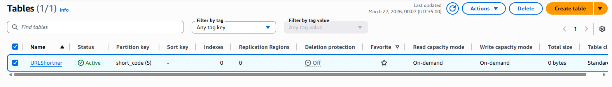
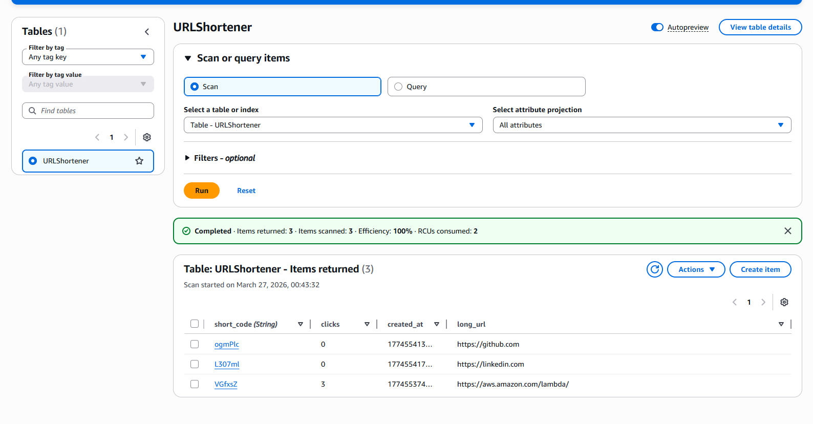
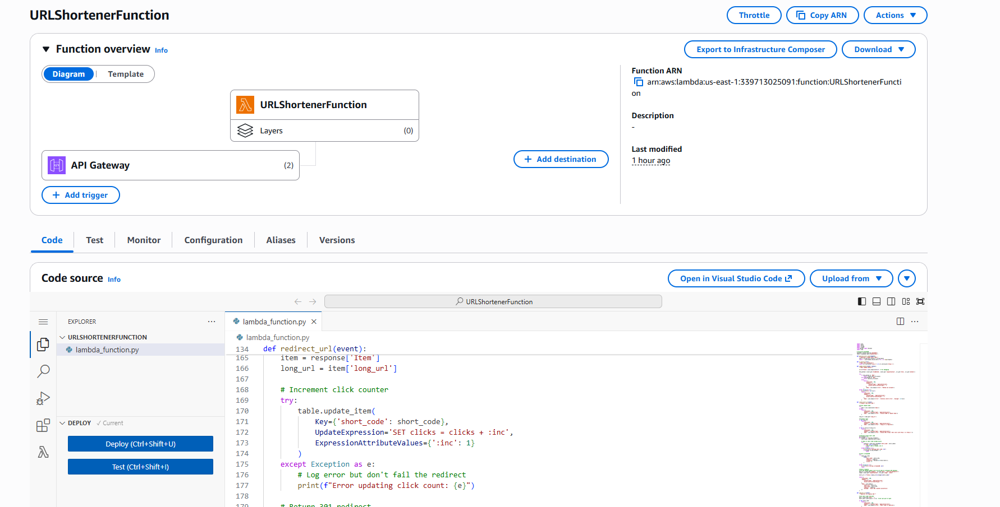
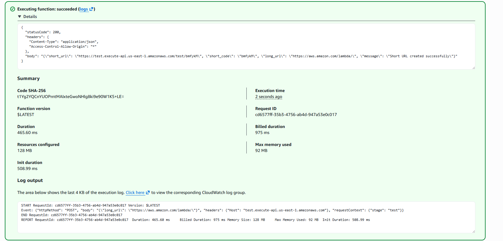
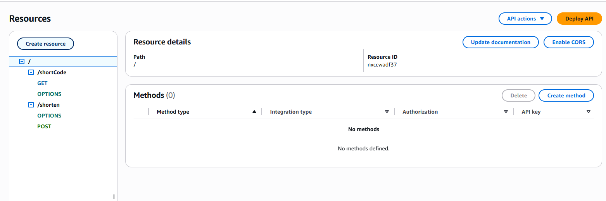
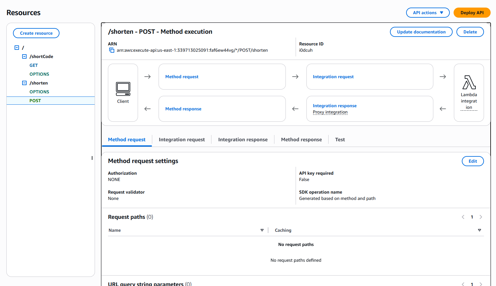
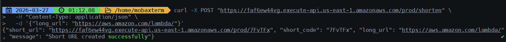
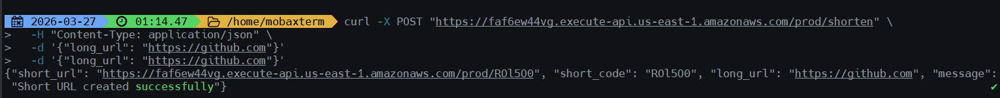
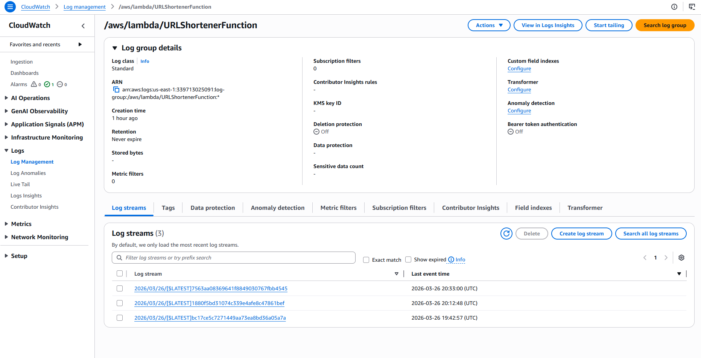
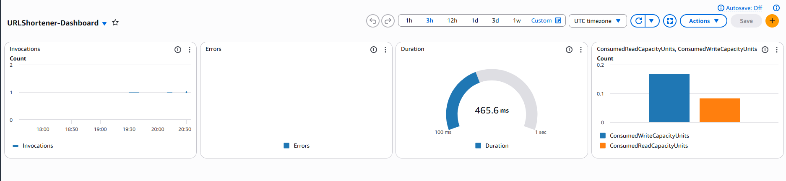

# Serverless URL Shortener on AWS

A highly scalable, cost-effective URL shortening service built using AWS serverless architecture. This project demonstrates the integration of AWS Lambda, Amazon DynamoDB, and Amazon API Gateway to create a fully functional REST API.

## 🏗️ Architecture

The service follows a standard serverless pattern:
1. **Amazon API Gateway**: Acts as the entry point, handling HTTP requests (POST for shortening, GET for redirection).
2. **AWS Lambda**: Processes the business logic, including generating short codes and managing redirects.
3. **Amazon DynamoDB**: Provides a NoSQL data store for mapping short codes to long URLs and tracking click counts.

---

## 🚀 Features

- **Shorten URLs**: Convert long URLs into 6-character unique short codes.
- **Redirection**: Automatically redirect users to the original URL via the short code.
- **Click Tracking**: Monitor how many times each shortened URL is accessed.
- **Serverless**: Zero infrastructure to manage, scales automatically with traffic.

---

## 🛠️ Technologies Used

- **Language**: Python 3.x
- **Compute**: AWS Lambda
- **Database**: Amazon DynamoDB
- **API Management**: Amazon API Gateway
- **SDK**: Boto3 (AWS SDK for Python)

---

## 📸 Project Walkthrough

### 1. Database Setup (DynamoDB)
The project uses a DynamoDB table named `URLShortener` with `short_code` as the Partition Key.

| Table Overview | Sample Items |
| :---: | :---: |
|  |  |

### 2. Lambda Function
The core logic is implemented in a Python Lambda function that interacts with DynamoDB.

| Function Configuration | Execution Result |
| :---: | :---: |
|  |  |

### 3. API Gateway Integration
The API provides two main endpoints: `/shorten` and `/{short_code}`.

| Resource Tree | POST Method Execution |
| :---: | :---: |
|  |  |

---

## 🔌 API Reference

For detailed API documentation, including request/response formats and examples, please refer to [docs/api-architecture.md](docs/api-architecture.md).

### Quick Summary

| Method | Endpoint | Description |
| :--- | :--- | :--- |
| `POST` | `/shorten` | Create a new short URL |
| `GET` | `/{short_code}` | Redirect to the original URL |

---

## 🧪 Testing

You can test the API using `curl` or any API client like Postman.

```bash
# Shorten a URL
curl -X POST https://your-api-id.execute-api.us-east-1.amazonaws.com/prod/shorten \
  -H "Content-Type: application/json" \
  -d '{"long_url": "https://aws.amazon.com/"}'

# Access the short URL
curl -I https://your-api-id.execute-api.us-east-1.amazonaws.com/prod/xK7p2L
```

| Curl Test 1 | Curl Test 2 |
| :---: | :---: |
|  |  |

---

## 📈 Monitoring

The service uses Amazon CloudWatch for logging, metrics, and dashboards.

| CloudWatch Logs | Dashboard Overview |
| :---: | :---: |
|  |  |

---

## 🛠️ Setup Instructions

1. **DynamoDB**: Create a table named `URLShortener` with `short_code` (String) as the Partition Key.
2. **Lambda**: Create a Python function, paste the code from `lambda/function.py`, and ensure it has permissions to access DynamoDB.
3. **API Gateway**: 
   - Create a REST API.
   - Add a `POST /shorten` resource and method.
   - Add a `GET /{proxy+}` or `GET /{short_code}` resource and method.
   - Deploy to a stage (e.g., `prod`).

---

## 📄 License

This project is licensed under the MIT License - see the LICENSE file for details.
